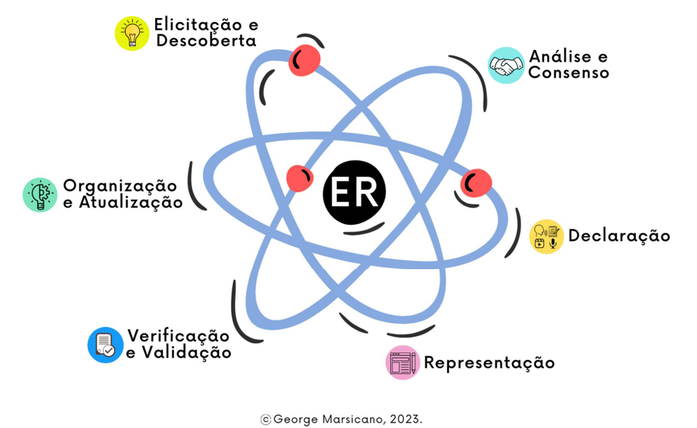

- **Abordagem:** Ágil
- **Ciclo de Vida:** Ágil (iterativo e incremental)
- **Processo:** SCRUM e RAD

A metodologia escolhida é uma combinação de **Scrum** com **Rapid Application Development (RAD)**, buscando unir a estrutura iterativa e o envolvimento ativo do cliente, característicos do Scrum, à prototipagem rápida e às entregas frequentes, que são marcas registradas do RAD.

## Ciclo de Vida e Processo:
- **Início Rápido:** Utilizando a abordagem RAD, iniciaremos com uma fase de planejamento enxuta para identificar os requisitos básicos e desenvolver protótipos iniciais.
- **Sprints de Desenvolvimento:** Seguindo o Scrum, organizamos sprints para desenvolver funcionalidades, com foco em prototipagem rápida e refinamento contínuo.
- **Revisões Constantes:** No fim de cada sprint, realizaremos revisões com as partes interessadas para validar as funcionalidades e coletar feedback para iterações futuras.

## Atividades de Engenharia de Requisitos:

- **Elicitação e Descoberta:** Técnicas de elicitação de requisitos são aplicadas para compreender e documentar as necessidades dos stakeholders.
- **Análise e Consenso:** Os requisitos elicitados são analisados para determinar a prioridade, viabilidade e buscar um consenso.
- **Declaração:** Documentação clara e detalhada dos requisitos é criada para servir como referência.
- **Representação:** Modelos e especificações visuais dos requisitos são desenvolvidos para uma melhor compreensão e comunicação.
- **Verificação e Validação:** Requisitos são verificados e validados para assegurar sua corretude e alinhamento com as necessidades do negócio.
- **Organização e Atualização:** Os requisitos são continuamente organizados e atualizados para refletir quaisquer mudanças ou novos entendimentos.

## Atividades

| Nome da Atividade | Método | Ferramenta | Entrega |
|-------------------|--------|------------|---------|
| Elicitação e Descoberta | Entrevistas com stakeholders e sessões de brainstorming | Teams | Uma lista de requisitos coletados |
| Análise e Consenso | Análise de requisitos e votação | Discord ou Teams e Google Docs e Kanban board (GitHub Projects) | MVP |
| Representação | Modelagem visual | Discord e Figma  | prototipagem de baixa fidelidade |
| Prototipagem | Individual ou pareado | Discord e Figma | Protótipos de media/alta fidelidade |
| Sprint de Desenvolvimento | Scrum | Kanban board (Git Projects) | Funcionalidades |
| Teste e Validação | Teste contínuo e iterativo | Ferramentas de CI/CD | Relatório de testes |
| Verificação e Validação | Sessões de validação com stakeholders | Teams | Levantamento de pontos fortes e aspectos de melhorias da equipe |
| Organização e Atualização | Gerenciamento de requisitos | Discord, Kanban board (Git Projects) e Google Docs  | Backlog de requisitos atualizado |
| Revisão e Retrospectiva | Cerimônia do scrum | Discord e WhatsApp | Feedback e Ajustes no Produto |
| Lançamento e Implementação | Estratégias de lançamento RAD | Ferramentas de build automatizado | Aplicativo mobile (APK) |
